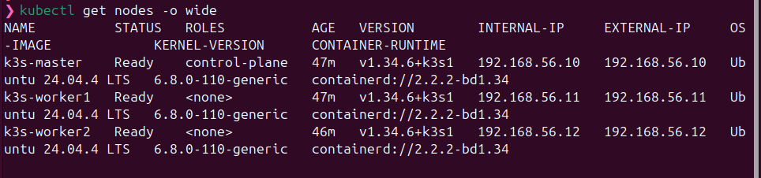
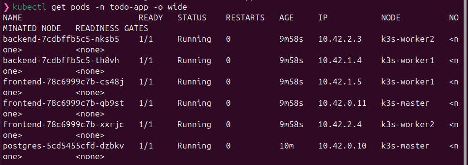
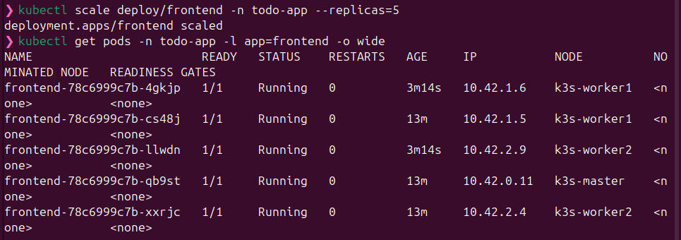
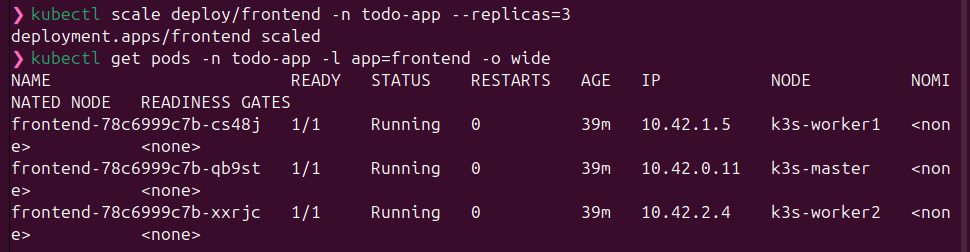
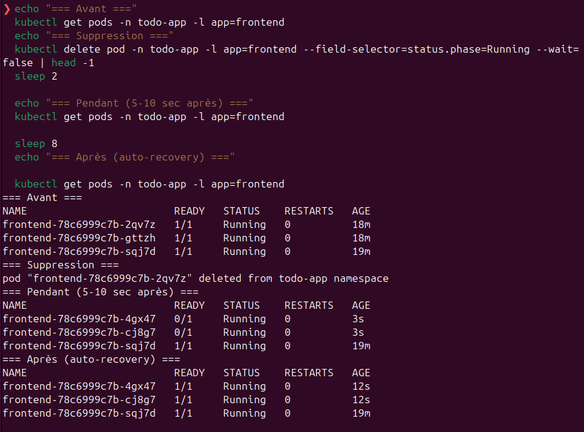
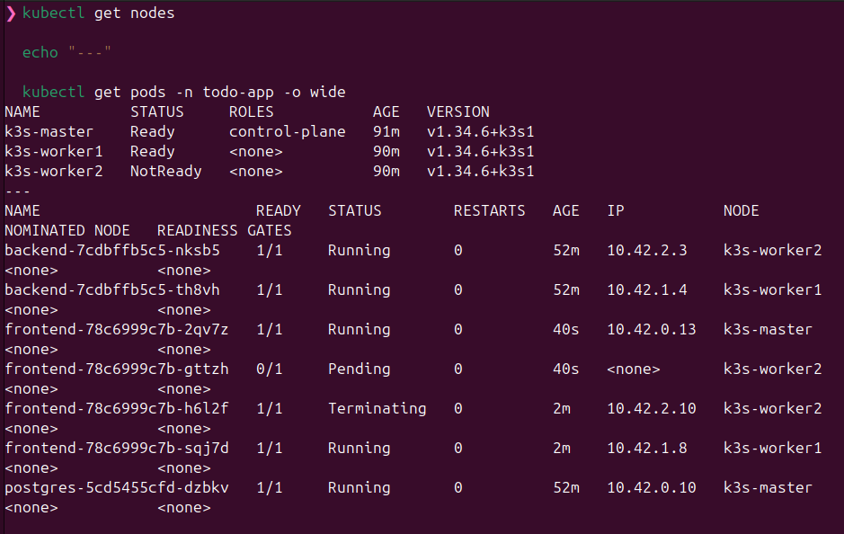
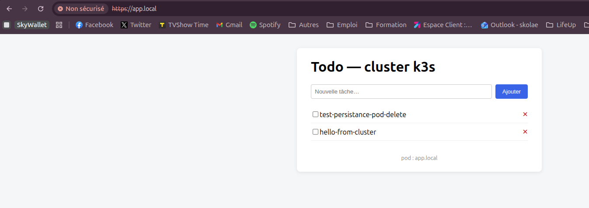
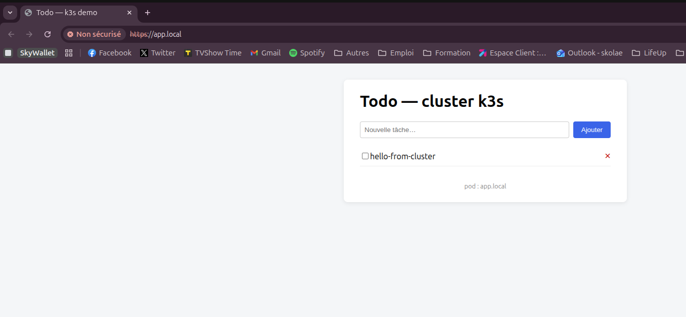

# 05 — Tests de haute disponibilité

Tous les tests ont été effectués sur le cluster déployé selon [04-app-deployment.md](04-app-deployment.md). Les captures sont dans `screenshots/`.

## Test 1 — Topologie cluster

```bash
kubectl get nodes -o wide
```

Résultat attendu : 3 nœuds `Ready`.



## Test 2 — État initial des pods

```bash
kubectl get pods -n todo-app -o wide
```

Résultat attendu : 6 pods `Running`, répartis sur les 3 nœuds (1 postgres sur master, 2 backend, 3 frontend).



## Test 3 — Scale up à 5 replicas frontend

```bash
kubectl scale deploy/frontend -n todo-app --replicas=5
kubectl get pods -n todo-app -l app=frontend -o wide
```

Résultat : 5 pods frontend `Running`. k3s les répartit sur les nœuds disponibles.



## Test 4 — Scale down à 3 replicas

```bash
kubectl scale deploy/frontend -n todo-app --replicas=3
kubectl get pods -n todo-app -l app=frontend -o wide
```

Résultat : retour à 3 pods. k3s a sélectionné quels pods supprimer (généralement les plus récents).



## Test 5 — Self-healing (kill pod)

```bash
kubectl delete pod -n todo-app -l app=frontend --field-selector=status.phase=Running
sleep 10
kubectl get pods -n todo-app -l app=frontend
```

Résultat : les pods supprimés sont remplacés automatiquement par le ReplicaSet en quelques secondes.



## Test 6 — Panne d'un worker

```bash
# Avant
kubectl get pods -n todo-app -o wide
# Coupure brutale
VBoxManage controlvm k3s-worker2 poweroff
# Après ~50 sec
kubectl get nodes
kubectl get pods -n todo-app -o wide
```

Résultat :
- Worker2 passe `NotReady` ~40 s après la coupure.
- Les pods sur worker2 passent `Terminating`, leurs replicas sont recréés sur master/worker1.
- Postgres n'est pas affecté (pinned sur master).

⚠️ **Délai d'éviction** : Kubernetes attend par défaut **5 minutes** (`tolerationSeconds: 300`) avant d'évincer définitivement les pods d'un nœud `NotReady`. C'est volontaire pour éviter les évictions inutiles en cas de coupure réseau temporaire.



Redémarrage du worker pour la suite des tests :
```bash
VBoxManage startvm k3s-worker2
```

## Test 7 — Persistance Postgres

1. Ajouter une todo via l'UI : `test-persistance-pod-delete`
2. Supprimer le pod Postgres :
   ```bash
   POD=$(kubectl get pod -n todo-app -l app=postgres -o jsonpath='{.items[0].metadata.name}')
   kubectl delete pod -n todo-app $POD
   kubectl wait --for=condition=ready pod -l app=postgres -n todo-app --timeout=120s
   ```
3. Rafraîchir la page : la todo est toujours là.

Résultat : le PVC est ré-attaché au nouveau pod (même nœud, même volume), les données sont conservées.



## Test 8 — UI accessible en HTTPS

URL : `https://app.local` (cert auto-signé, accepter le warning navigateur).

Fonctionnalités testées dans l'UI :
- Création d'une tâche
- Cocher / décocher
- Suppression
- Persistance après rafraîchissement



## Synthèse

| Critère barème | Validé via | Capture |
|---|---|---|
| 3 nœuds Ready | Test 1 | `test1-nodes.png` |
| Réplicas conformes (3 front, 2 back, 1 db) | Test 2 | `test2-pods-initial.png` |
| Scaling horizontal | Tests 3 & 4 | `test3-scale-up.png`, `test4-scale-down.png` |
| Self-healing pod | Test 5 | `test5-kill-pod.png` |
| Tolérance panne nœud | Test 6 | `test6-node-failure.png` |
| Persistance volume | Test 7 | `test7-persistence-ui.png` |
| Exposition HTTPS | Test 8 | `test8-ui-https.png` |
