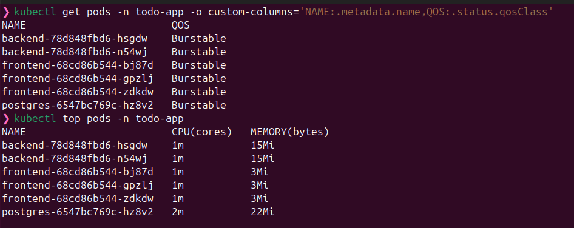
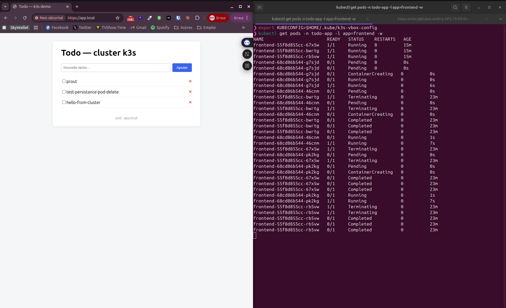
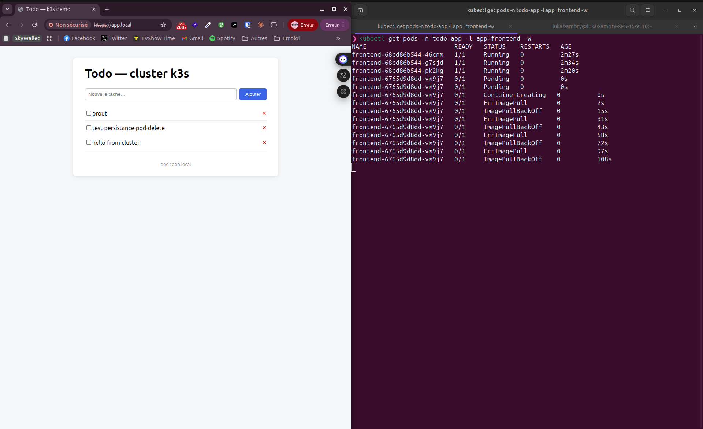
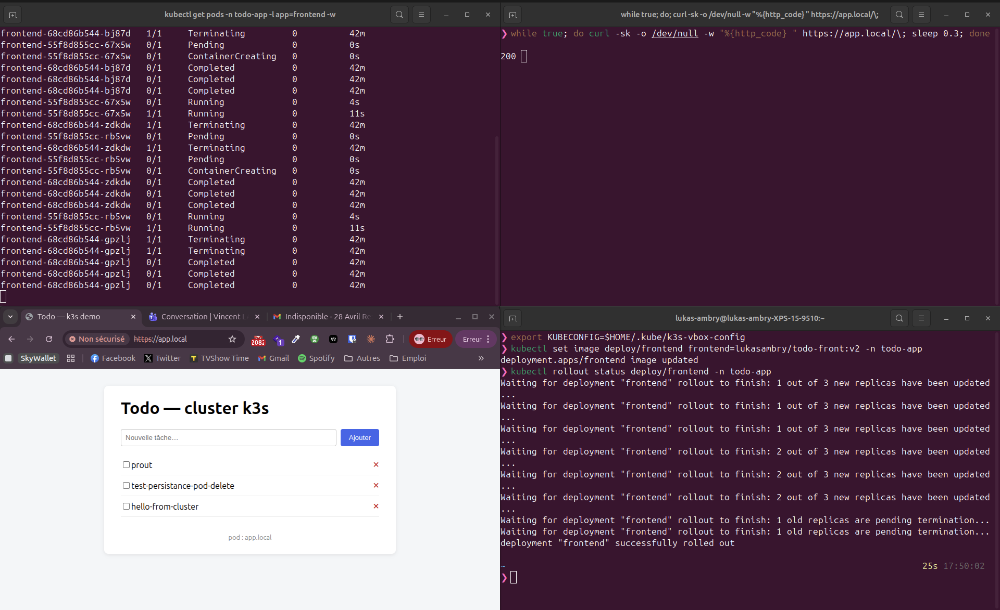
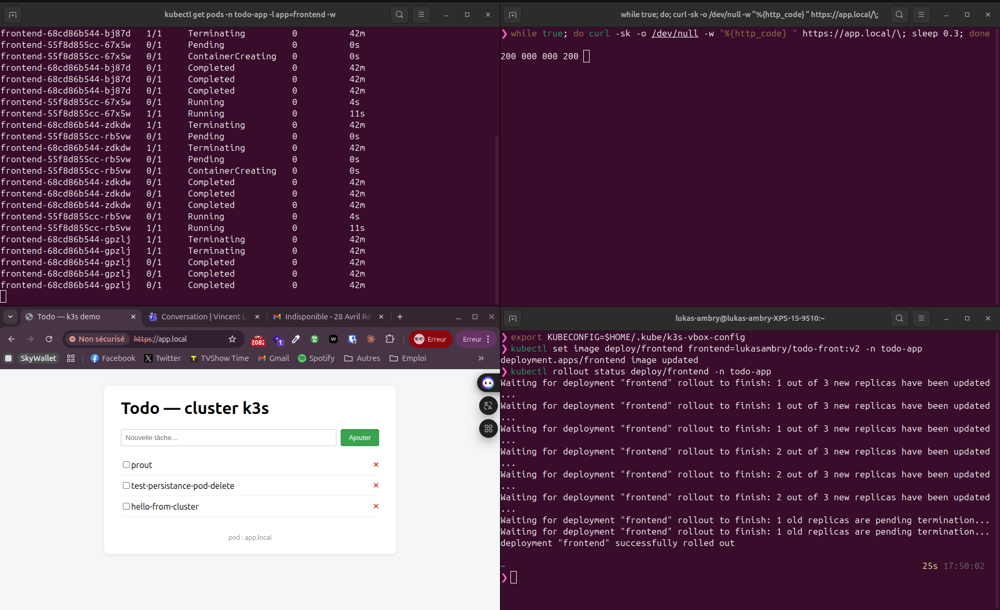
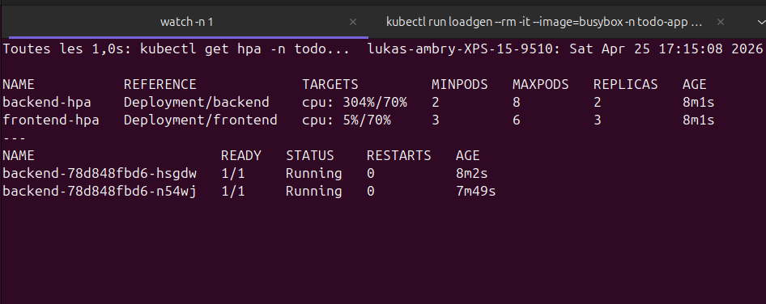
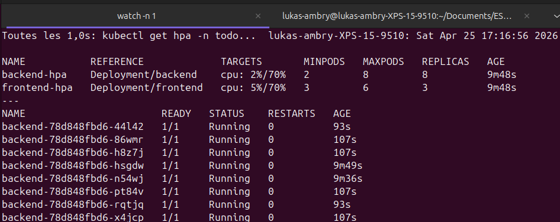

# 07 — Bonus implémentés

Cette page documente les fonctionnalités avancées Kubernetes ajoutées à la base 15/15. Tous les bonus sont **additifs** : ils n'altèrent pas le comportement validé en [05-tests-ha.md](05-tests-ha.md).

## Bonus 1 — Resource Requests & Limits + QoS

### Manifest

Ajout d'un bloc `resources` dans chaque container des Deployments :

| Composant | requests CPU | requests memory | limits CPU | limits memory | QoS class |
|---|---|---|---|---|---|
| `frontend` (nginx) | 20m | 32Mi | 200m | 128Mi | Burstable |
| `backend` (node) | 50m | 64Mi | 500m | 256Mi | Burstable |
| `postgres` | 100m | 128Mi | 1000m | 512Mi | Burstable |

### Effets

- **Scheduling** : k3s ne peut placer un pod que si le nœud a au moins les `requests` disponibles.
- **OOM protection** : si un pod dépasse `memory.limit`, il est OOM-killed → redémarré.
- **Throttling CPU** : si un pod dépasse `cpu.limit`, il est throttled (ralenti) mais pas tué.
- **QoS class `Burstable`** : pods avec requests < limits → priorité moyenne en cas de pression mémoire (prioritaires sur les pods sans `resources` qui seraient `BestEffort`).

### Démonstration

```bash
kubectl get pods -n todo-app -o custom-columns='NAME:.metadata.name,QOS:.status.qosClass'
# → tous Burstable
kubectl top pods -n todo-app
# → consommation réelle (CPU/mémoire)
kubectl describe pod -n todo-app -l app=backend | grep -A3 'Requests\|Limits'
```



## Bonus 2 — Rollback automatique + manuel

### Manifest

Deux paramètres ajoutés à chaque Deployment :

```yaml
spec:
  revisionHistoryLimit: 5         # garde les 5 dernières versions du Deployment
  progressDeadlineSeconds: 300    # rollout marqué Failed s'il prend > 5 min
```

### Effets

- **`progressDeadlineSeconds`** : si le rollout n'avance pas en 5 min (ex : pods qui ne passent jamais Ready, image inexistante, OOM-kill répété), le Deployment passe en condition `Progressing=False, Reason=ProgressDeadlineExceeded`. Combiné aux **probes existantes** (`liveness`/`readiness`), un déploiement cassé est détecté tôt — les pods ne reçoivent jamais de trafic tant qu'ils ne sont pas Ready.
- **`revisionHistoryLimit: 5`** : conserve l'historique des 5 dernières versions, exploitable via `kubectl rollout undo`.

### Démonstration — rollback manuel

```bash
# 1. Voir l'historique des revisions
kubectl rollout history deploy/backend -n todo-app

# 2. Pousser une "mauvaise" version (ex : image inexistante)
kubectl set image deploy/backend backend=lukasambry/todo-back:badversion -n todo-app

# 3. Le rollout va stagner — vérifier le statut
kubectl rollout status deploy/backend -n todo-app --timeout=60s
# → erreur ImagePullBackOff sur les nouveaux pods

# 4. Rollback automatique vers la dernière version qui marche
kubectl rollout undo deploy/backend -n todo-app

# 5. Vérifier
kubectl rollout status deploy/backend -n todo-app
kubectl get pods -n todo-app -l app=backend
```

Pendant tout ce processus, l'**app reste accessible** : `maxUnavailable: 0` (cf. bonus 3) garantit qu'au moins 2 pods backend sains tournent en permanence.

**Captures du cycle complet** :

1. *Rollback manuel* — l'image passe de `v2` à `v1`, le bouton du navigateur redevient bleu :

   

2. *Déploiement cassé sans downtime* — image inexistante poussée volontairement. Le nouveau pod cycle en `ErrImagePull` ↔ `ImagePullBackOff` (back-off exponentiel) tandis que les 3 anciens pods sains continuent à servir le trafic. Le navigateur ne voit aucune dégradation.

   

## Bonus 3 — Rolling Update (zéro downtime)

### Manifest

Bloc `strategy` explicite sur les Deployments stateless (`backend`, `frontend`) :

```yaml
spec:
  strategy:
    type: RollingUpdate
    rollingUpdate:
      maxSurge: 1            # max 1 pod EN PLUS pendant l'update
      maxUnavailable: 0      # 0 pod KO = zéro downtime garanti
```

`postgres` reste en `strategy: Recreate` car le PVC est `ReadWriteOnce` — deux pods Postgres ne peuvent pas se partager le même volume en simultané.

### Effets

Lors d'un `kubectl set image` ou `kubectl apply` qui change l'image d'un Deployment :
- k3s crée 1 pod avec la nouvelle version (sur 4 pods totaux pour le frontend).
- Attend qu'il soit `Ready` (probes vertes).
- Tue 1 ancien pod.
- Recommence jusqu'à ce que tous les pods soient en nouvelle version.
- À tout instant : ≥ N pods sains servent le trafic (N = replicas configuré, 0 unavailable).

### Démonstration — upgrade sans downtime

Build d'une `v2` (changement visuel mineur, ex : couleur du bouton) :
```bash
# Sur le host, après avoir édité app/frontend/src/App.jsx ou similar
./scripts/build-and-push.sh v2
```

Lancer l'upgrade et observer :
```bash
# Terminal 1 : pousser le rolling update
kubectl set image deploy/frontend frontend=lukasambry/todo-front:v2 -n todo-app

# Terminal 2 : observer la transition
kubectl get pods -n todo-app -l app=frontend -w

# Terminal 3 : rafraîchir https://app.local en boucle pour voir qu'il reste accessible
while true; do curl -sk -o /dev/null -w "%{http_code}\n" https://app.local/; sleep 0.5; done
# → 200 en continu, jamais d'erreur
```

Capture pour la doc :
```bash
kubectl rollout history deploy/frontend -n todo-app
```

**Captures du rolling update** :

1. *En cours* — anciens pods en `Terminating`, nouveaux en `Pending` / `ContainerCreating` / `Running`, terminal HTTP qui montre `200 200 200 ...` avec ~1 % de pertes pendant la transition (`000` lors des fermetures TCP de Traefik, normal sans `preStop` hook) :

   

2. *Rollout terminé* — `deployment "frontend" successfully rolled out`, le bouton est passé au vert (v2 actif) :

   

## Bonus 4 — Horizontal Pod Autoscaler (HPA)

### Manifest

Deux nouveaux manifests :
- `k8s/12-backend-hpa.yaml` : 2 → 8 replicas, cible 70 % CPU
- `k8s/13-frontend-hpa.yaml` : 3 → 6 replicas, cible 70 % CPU

### Pré-requis

- **`metrics-server`** installé. ✅ Déjà fourni par k3s.
- **`resources.requests.cpu`** défini sur le Deployment. ✅ Fourni par le bonus 1.

### Effets

- Toutes les 15 secondes, le contrôleur HPA mesure le CPU consommé en moyenne par les pods.
- Si > 70 % de la `request.cpu`, il scale up (création de pods).
- Si < 70 %, il scale down (suppression de pods), avec un **`stabilizationWindowSeconds: 300`** (5 min) pour éviter le yo-yo.

### Démonstration — load test

```bash
# Vérifier l'état initial
kubectl get hpa -n todo-app
# → backend-hpa  cpu: 2%/70%  REPLICAS: 2
# → frontend-hpa cpu: 5%/70%  REPLICAS: 3

# Générer une charge sur le backend (depuis un pod éphémère)
kubectl run loadgen --rm -it --image=busybox -n todo-app -- /bin/sh -c \
  "while true; do wget -q -O- http://backend:3000/api/todos; done"

# Dans un autre terminal, observer
kubectl get hpa -n todo-app -w
# → la valeur cpu monte (par ex. 80%, 95%, 120%...)
# → REPLICAS passe à 3, 4, 5, 6...
kubectl get pods -n todo-app -l app=backend -w

# Couper le loadgen avec Ctrl+C
# → CPU% retombe quasi instantanément
# → Au bout de ~5 min (stabilizationWindowSeconds), REPLICAS redescend à 2
```

**Captures du cycle de scaling** :

1. *Charge détectée* — CPU à 304 % du target (70 %), HPA en cours d'évaluation, REPLICAS encore à 2 :

   

2. *Scale-up complet* — après ~1 min, le HPA a atteint `MAXPODS: 8`. Le CPU moyen redescend à 2 % parce que la charge est répartie sur 8 pods :

   

## Récapitulatif barème

| # | Bonus | Manifest(s) modifié(s)/ajouté(s) | Validé via |
|---|---|---|---|
| 1 | Resource Requests & Limits + QoS | `04-postgres`, `06-backend`, `08-frontend` | `kubectl top pods`, `kubectl get pods -o ... QOS:.status.qosClass` |
| 2 | Rollback automatique + manuel | `04-postgres`, `06-backend`, `08-frontend` | `kubectl rollout history` + `kubectl rollout undo` |
| 3 | Rolling Update (zéro downtime) | `06-backend`, `08-frontend` | `kubectl set image` + `curl` en boucle pendant rollout |
| 4 | HPA | `12-backend-hpa.yaml`, `13-frontend-hpa.yaml` (nouveaux) | load test → REPLICAS qui monte/descend |

